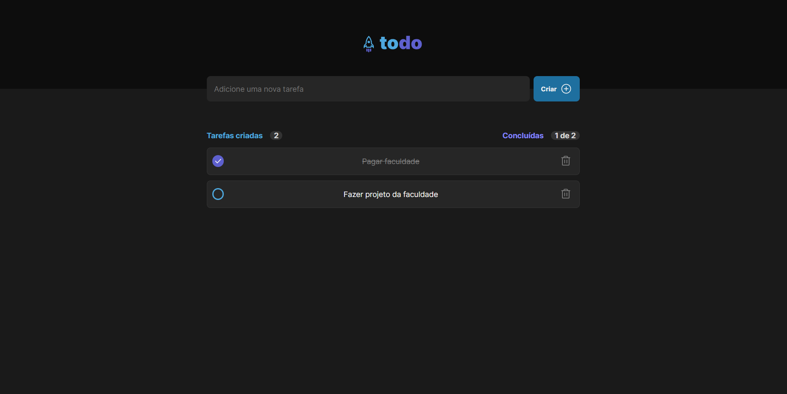

  

## ✨ Technologies

This project was developed with the following technologies:

- React
- TypeScript
- radix-ui
- styled-components
- eslint

## 💻 Project

Project is a TODO list with react. Being able to add tasks, remove them and mark them as completed.

## 🚀 Deploy

- Clone the repository
- Install dependencies with `npm install`
- Start the server with `npm run dev`
